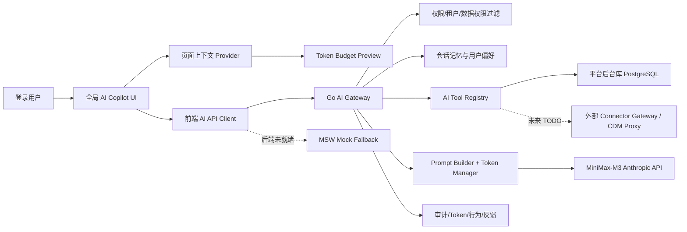

# Goal: 生产级 DataGov AI Copilot

**生成日期**：2026-06-09
**复杂度**：High
**适用范围**：DataGov 前端、Go 后端、MSW Mock、AI Gateway、权限与审计
**执行原则**：后续 Goal 执行时，若接口、数据或细节不确定，优先使用 MSW 模拟数据补齐闭环，不阻塞主链路。

## 1. 可直接用于 Goal 的目标语句

在 `D:\devops\DataGov` 中完成生产级 AI Copilot 接入：基于现有全局 AI 助手、Go AI Gateway、MiniMax Anthropic-compatible 模型调用与已有登录体系，分阶段实现会话管理、上下文构建、Token 预算与压缩、用户偏好与行为学习、AI 工具调用框架、结构化输出、安全审计、配额限流和 MSW fallback。每个阶段都必须可运行、可演示、可回滚；不确定的后端接口或业务数据先通过 `src/mock/data.ts`、`src/mock/handlers.ts`、`src/services/api.ts` 模拟，页面不得硬编码业务 Mock 数据。最终至少通过 `npx.cmd vite build --emptyOutDir=false`，后端改动通过 `go test ./...` 或等价模块内测试。

## 2. 背景与现状基线

当前 AI 助手已经从纯 UI 进入真实后端接入阶段，但仍偏“全局问答浮窗”，还不是生产级数据治理 Copilot。

### 已有能力

- 前端已有全局 AI 入口，登录后可在任意页面唤起 AI 助手。
- 前端当前向后端传递的上下文较薄，主要包含 `viewId`、`viewTitle`、`url` 等页面信息。
- 后端已有 Go AI Gateway，并暴露 `GET /api/v1/ai/capabilities` 与 `POST /api/v1/ai/assistant/messages`。
- 后端已接入 MiniMax Anthropic-compatible API，并记录基础 AI session/message 审计。
- 已有基础脱敏、登录态、PostgreSQL、Redis、MSW passthrough 和远程服务联通准备。

### 核心短板

- 缺少正式的会话列表、历史继续、搜索、归档、收藏和消息反馈。
- 缺少 Token 预算、历史压缩、上下文裁剪、会话摘要和成本统计。
- 缺少用户偏好、用户行为习惯、常用页面/数据源/SQL 方言的持续学习。
- 缺少页面级上下文 Provider，AI 无法稳定理解“当前页面正在做什么”。
- 缺少工具调用框架，无法安全读取元数据、脚本、标准、血缘、质量规则等上下文。
- 缺少结构化产物，例如 SQL 分析 JSON、血缘影响 JSON、质量规则草稿 JSON。
- 缺少生产级安全边界，例如权限过滤、Prompt Injection 防护、配额、限流和可观测性。

## 3. 范围与非目标

### 本阶段必须完成

- 将 AI 助手从“单轮问答”升级为“有会话、有记忆、有预算、有反馈、有上下文、有工具”的 Copilot。
- 前后端 API 先形成稳定契约，后端未就绪处允许 MSW 先模拟。
- 用户可以在任意页面打开 AI，查看历史会话，继续对话，并让 AI 基于当前页面上下文分析。
- 系统能记录用户行为、偏好、Token 使用、模型调用和 AI 工具调用审计。
- 所有生产级能力必须有安全默认值，尤其是权限过滤、脱敏、只读工具优先和敏感信息不入库。

### 本阶段不做

- 不在 DataGov 内实现 Connector Gateway / CDM 类源数据代理项目。
- 不直接连接或扫描外部源数据内容；除平台后台库外，源数据访问长期走独立数据代理接口。
- 不允许 AI 自动执行破坏性 SQL、发布脚本、删除数据、修改权限或绕过审批。
- 不引入 Java 后端技术栈。
- 不把 MiniMax token、数据库密码、SSH 密码等密钥写入文档、代码或 Mock 数据。

## 4. 目标架构



## 5. 设计原则

- **Conversation first**：所有 AI 消息必须归属于会话，单轮问答只是会话的特例。
- **Context previewable**：发送给模型的页面上下文、工具结果摘要和历史摘要应可预览、可裁剪。
- **Token budget bounded**：每次请求必须有预算上限，超过预算时按规则压缩、摘要、裁剪。
- **Read-only tools first**：第一阶段工具只读平台元数据和脚本，不直接访问外部源数据，不执行危险动作。
- **User memory opt-out ready**：用户偏好与行为学习默认服务体验，但设计上保留关闭、清空和审计能力。
- **Mock without lying**：MSW 可以模拟接口和业务数据，但 UI 需要明确表现为开发/模拟状态，不伪装生产真实结果。
- **Security by default**：权限、脱敏、Prompt Injection 检查、审计、限流是默认链路，不是后续补丁。

## 6. 数据模型规划

优先基于现有 `ai_sessions`、`ai_messages` 平滑扩展；如果迁移成本可控，再统一命名为 conversation。API 层统一使用 `conversation` 概念。

| 表/对象 | 用途 | 关键字段建议 |
| --- | --- | --- |
| `ai_conversations` 或扩展 `ai_sessions` | 会话主表 | `id`、`user_id`、`title`、`status`、`source_view_id`、`source_url`、`favorite`、`archived_at`、`last_message_at` |
| `ai_messages` | 消息明细 | `id`、`conversation_id`、`role`、`content`、`structured_content`、`model`、`status`、`token_usage_id` |
| `ai_conversation_summaries` | 历史压缩摘要 | `conversation_id`、`summary`、`covered_message_ids`、`token_count`、`version` |
| `ai_context_snapshots` | 每次请求上下文快照 | `conversation_id`、`message_id`、`view_id`、`context_json`、`redaction_report` |
| `ai_user_profiles` | 用户画像汇总 | `user_id`、`preferred_dialect`、`domains`、`frequent_views`、`summary_json` |
| `ai_user_preferences` | 用户显式偏好 | `user_id`、`answer_style`、`sql_dialect`、`language`、`show_token_preview`、`memory_enabled` |
| `ai_behavior_events` | 用户行为事件 | `user_id`、`conversation_id`、`message_id`、`event_type`、`event_payload`、`created_at` |
| `ai_message_feedback` | 反馈与评价 | `message_id`、`user_id`、`rating`、`reason`、`comment` |
| `ai_token_usage` | Token 与成本 | `message_id`、`model`、`input_tokens`、`output_tokens`、`estimated_cost`、`latency_ms` |
| `ai_prompt_templates` | Prompt 模板版本 | `code`、`version`、`template`、`status`、`updated_by` |
| `ai_tool_calls` | 工具调用审计 | `message_id`、`tool_name`、`args_json`、`result_summary`、`status`、`latency_ms` |

## 7. API 契约规划

后端未完成前，以下接口先由 MSW 模拟；后端完成后，MSW 对真实接口 passthrough。

| 方法 | 路径 | 用途 |
| --- | --- | --- |
| `GET` | `/api/v1/ai/capabilities` | 获取能力卡片、建议问题、可用工具 |
| `GET` | `/api/v1/ai/conversations` | 会话列表，支持分页、搜索、归档过滤 |
| `POST` | `/api/v1/ai/conversations` | 新建会话，可传初始页面上下文 |
| `GET` | `/api/v1/ai/conversations/{id}` | 会话详情与消息历史 |
| `PATCH` | `/api/v1/ai/conversations/{id}` | 更新标题、收藏、归档状态 |
| `POST` | `/api/v1/ai/conversations/{id}/messages` | 发送消息，返回 AI 回复，可先非流式 |
| `POST` | `/api/v1/ai/messages/{id}/regenerate` | 基于同一上下文重新生成 |
| `POST` | `/api/v1/ai/messages/{id}/feedback` | 点赞、点踩、原因、备注 |
| `POST` | `/api/v1/ai/behavior-events` | 记录复制、采纳、保存脚本、点击建议等行为 |
| `GET` | `/api/v1/ai/preferences` | 读取当前用户 AI 偏好 |
| `PUT` | `/api/v1/ai/preferences` | 更新当前用户 AI 偏好 |
| `POST` | `/api/v1/ai/context/preview` | 预览本次将发送的上下文与 Token 估算 |
| `GET` | `/api/v1/ai/token-usage` | 当前用户 Token 用量与配额概览 |
| `GET` | `/api/v1/ai/tools` | 获取可用工具与权限状态 |

## 8. 前端实施范围

### 重点文件

- `src/components/ai/AiAssistant.tsx`
- `src/services/api.ts`
- `src/types/api.ts`
- `src/mock/data.ts`
- `src/mock/handlers.ts`
- 可新增 `src/components/ai/*` 子组件，但不要把业务 Mock 数据放在组件内。

### UI/交互目标

- AI 面板保留全局唤起，支持浮窗/展开两种模式。
- 左侧或顶部增加会话入口：最近会话、搜索、收藏、归档。
- 对话区支持历史加载、继续追问、重新生成、复制、反馈、保存为脚本草稿。
- 输入区支持能力模式：写 SQL、分析 SQL、分析血缘、解释知识、生成质量规则、诊断脚本。
- 当前页面上下文可见：展示“本次将附带哪些上下文”，允许用户移除部分上下文。
- Token 预估可见：展示历史、页面上下文、工具结果、用户消息的大致预算占比。
- 用户偏好可编辑：SQL 方言、回答风格、是否使用长期记忆、是否默认展示上下文预览。

### 页面上下文 Provider

先实现轻量 Provider 注册表，不要一次性改动所有页面。

| 页面/能力 | 上下文建议 |
| --- | --- |
| 脚本开发 | 当前脚本 ID、类型、SQL 方言、选中代码、运行结果摘要、错误日志 |
| 数据源管理 | 当前数据源 ID、类型、连接状态、最近同步状态，不包含密码 |
| 元数据管理 | 当前资产、表、字段、业务域、分层、标签 |
| 数据标准 | 当前标准、映射关系、落标状态 |
| 数据质量 | 当前规则、最近检查结果、异常摘要 |
| 血缘分析 | 当前节点、上下游层级、影响范围摘要 |

## 9. 后端实施范围

### 重点文件方向

- `backend/internal/modules/ai/*`
- `backend/internal/platform/server/ai.go`
- `backend/migrations/*`
- `backend/internal/modules/auth/*`
- 可按现有模块化单体方式扩展，不急于拆服务。

### 后端能力目标

- 会话服务：创建、查询、归档、收藏、标题自动生成或手动修改。
- 消息服务：发送、存储、重新生成、反馈、状态记录。
- Token Manager：估算、裁剪、摘要、预算检查、用量落库。
- Context Builder：合并页面上下文、用户偏好、历史摘要、工具结果。
- Tool Registry：注册只读工具，执行前做权限过滤，执行后做结果摘要与脱敏。
- Prompt Builder：按能力模式选择模板，记录模板版本。
- Safety Guard：脱敏、Prompt Injection 检查、危险动作拒绝、速率限制、审计。
- Observability：模型延迟、错误码、Token 用量、工具调用耗时。

## 10. Token 优化设计

### 默认预算建议

- `max_input_tokens`：按模型能力配置，开发期可先设置保守值。
- `conversation_history_budget`：历史消息只保留最近 N 轮，其余进入摘要。
- `page_context_budget`：页面上下文只传必要字段和用户选中内容。
- `tool_result_budget`：工具结果默认摘要化，不传完整大结果集。
- `user_profile_budget`：只传与当前能力相关的偏好，不传完整画像。

### 裁剪顺序

1. 移除低优先级页面上下文。
2. 压缩工具结果为摘要。
3. 将旧消息合并进 `ai_conversation_summaries`。
4. 只保留最近关键轮次和用户最新问题。
5. 若仍超限，阻止请求并提示用户缩小范围。

### 必须落库

- 每次模型请求的输入/输出 Token。
- 每次上下文构建的预算分布。
- 是否发生裁剪、摘要、拒绝。
- 模型名称、延迟、错误信息和请求状态。

## 11. 用户对话、偏好与行为学习

### 会话能力

- 新建会话、继续会话、重命名、归档、收藏、删除或软删除。
- 会话标题可由首轮问题自动生成，用户可手动编辑。
- 会话列表支持按页面来源、能力类型、关键字过滤。

### 用户偏好

- SQL 方言默认值：优先用户显式设置，其次当前脚本类型，其次 PostgreSQL。
- 回答风格：简洁、详细、教学型、审查型。
- 业务偏好：常用业务域、常用数据源、常用页面。
- 记忆开关：允许关闭长期偏好使用，关闭后只使用当前会话上下文。

### 行为事件

| 事件 | 触发时机 | 用途 |
| --- | --- | --- |
| `message_copied` | 复制 AI 回复 | 判断回复可复用性 |
| `sql_saved_as_script` | 保存 SQL 为脚本草稿 | 学习用户常用脚本类型 |
| `suggestion_clicked` | 点击建议问题 | 优化建议排序 |
| `message_regenerated` | 重新生成 | 判断回答质量 |
| `feedback_submitted` | 提交点赞/点踩 | 质量评估 |
| `context_removed` | 用户移除上下文 | 学习敏感或无用上下文 |
| `tool_result_accepted` | 采纳工具结果 | 调整工具优先级 |

## 12. AI 工具框架

第一阶段只做只读工具，并且只读取 DataGov 平台后台库中的治理元数据、脚本元数据和任务记录。

| 工具 | 输入 | 输出 | 风险控制 |
| --- | --- | --- | --- |
| `metadata.searchAssets` | 关键词、业务域、类型 | 资产摘要列表 | 权限过滤、结果截断 |
| `metadata.getAssetSchema` | 资产 ID | 字段、类型、标签摘要 | 不返回敏感样本值 |
| `development.getScript` | 脚本 ID | 脚本元信息与内容 | 按用户权限校验 |
| `development.searchScripts` | 关键词、类型 | 脚本摘要列表 | 只返回可见脚本 |
| `standard.searchStandards` | 关键词、域 | 标准摘要 | 结果摘要化 |
| `quality.searchRules` | 资产/关键词 | 质量规则摘要 | 不执行检查 |
| `lineage.getImpactSummary` | 节点 ID | 上下游摘要 | 可先 MSW 模拟 |

未来数据代理项目完成后，再新增外部源数据工具；当前只保留 TODO，不在 DataGov 内实现。

## 13. 分阶段实施计划

### Sprint 1：会话基础与 MSW 闭环

**目标**：AI 助手具备正式会话模型，即使后端未完全就绪，也能通过 MSW 演示完整交互。

**任务**

1. 在 `src/types/api.ts` 增加 AI conversation、message、feedback、preference、token usage 类型。
2. 在 `src/services/api.ts` 增加会话、消息、反馈、偏好、行为事件 API 函数。
3. 在 `src/mock/data.ts` 增加 AI 会话、消息、偏好、行为、Token 用量 Mock 数据。
4. 在 `src/mock/handlers.ts` 增加 AI 会话接口 Mock，并保持真实后端可用时 passthrough 策略。
5. 重构 `src/components/ai/AiAssistant.tsx`，拆分会话列表、消息区、输入区、上下文预览区。

**验收**

- 用户能新建会话、继续历史会话、归档/收藏会话。
- 发送消息后 UI 能展示用户消息、AI 回复、Token 估算和反馈入口。
- 后端不可用时，MSW 能支撑完整演示。
- 前端构建通过 `npx.cmd vite build --emptyOutDir=false`。

### Sprint 2：后端会话与消息持久化

**目标**：真实后端接管会话与消息主链路，MSW 只保留开发 fallback。

**任务**

1. 在 `backend/migrations` 增加或扩展 AI 会话、消息、反馈、Token 表。
2. 在 `backend/internal/modules/ai` 增加 conversation/message repository 与 service。
3. 在 `backend/internal/platform/server/ai.go` 注册会话、消息、反馈、偏好接口。
4. 将现有 `/api/v1/ai/assistant/messages` 兼容迁移到会话消息接口。
5. 补齐登录用户权限校验，所有 AI 数据按当前用户隔离。

**验收**

- 登录用户只能看到自己的 AI 会话。
- 刷新页面后，会话与消息历史仍存在。
- AI 回复、反馈、Token 用量可落库。
- 后端测试通过 `go test ./...` 或在 `backend` 模块内通过等价测试。

### Sprint 3：上下文构建与 Token 预算

**目标**：AI 请求携带可控、可预览、可裁剪的上下文，而不是盲目拼接全部数据。

**任务**

1. 定义前端页面上下文 Provider 接口，优先接入脚本开发和数据源管理页面。
2. 增加 `/api/v1/ai/context/preview`，返回上下文块、脱敏结果和 Token 估算。
3. 后端实现 Token Budget Manager，支持历史摘要、上下文优先级、工具结果压缩。
4. 增加 `ai_conversation_summaries` 与摘要生成逻辑。
5. UI 展示“本次将发送的上下文”，允许用户移除上下文块。

**验收**

- 用户能看到页面上下文预览和预算占比。
- 长会话不会无限拼接历史消息。
- 超预算时系统能自动压缩或明确提示缩小范围。
- 脚本开发页能让 AI 基于当前 SQL、错误日志或选中代码分析。

### Sprint 4：用户偏好与行为学习

**目标**：AI 助手能记住用户显式偏好，并从非敏感行为中优化默认体验。

**任务**

1. 增加用户 AI 偏好读取/更新接口与 UI 设置入口。
2. 记录复制、采纳、保存脚本、点击建议、重新生成、反馈等行为事件。
3. 后端聚合用户画像摘要，不存储敏感原文或密钥。
4. Prompt Builder 在安全范围内使用用户偏好，如 SQL 方言、回答风格、常用业务域。
5. 增加“关闭长期记忆/清空偏好摘要”的接口预留或实现。

**验收**

- 用户设置默认 SQL 方言后，后续写 SQL 默认使用该方言。
- 用户行为事件能被记录并在开发环境可查看。
- 关闭长期记忆后，请求不再携带用户画像摘要。
- 反馈能关联到具体 AI 消息。

### Sprint 5：工具调用与结构化产物

**目标**：AI 不只聊天，还能安全调用只读平台工具，产出可落地的治理分析结果。

**任务**

1. 后端实现 AI Tool Registry 和工具调用审计。
2. 优先实现脚本、元数据、标准、质量、血缘摘要等只读工具。
3. Prompt Builder 支持工具结果摘要注入。
4. 定义结构化输出 schema：SQL 分析、血缘影响、质量规则草稿、脚本诊断。
5. 前端展示结构化结果卡片，并提供复制、保存草稿、跳转相关页面等动作。

**验收**

- AI 能根据当前脚本调用脚本读取工具并解释 SQL。
- AI 能基于 Mock 或平台元数据生成血缘影响摘要。
- 工具调用有审计记录、耗时、状态和结果摘要。
- 结构化结果能以卡片展示，不只是纯 Markdown。

### Sprint 6：安全、配额与可观测性

**目标**：补齐生产级上线前的安全与运营底座。

**任务**

1. 增加 `ai:assistant:use`、`ai:tools:read` 等权限点，接入现有角色权限模型。
2. 增加用户级/全局级限流与配额，优先使用 Redis。
3. 增强脱敏规则，覆盖 token、password、secret、连接串、手机号、身份证等。
4. 增加 Prompt Injection 基础检测，对要求泄露系统提示词、绕过权限的请求做拒绝或降级。
5. 增加 AI 调用监控视图或后端日志指标：成功率、延迟、Token、错误码、工具耗时。

**验收**

- 无权限用户无法使用 AI 或工具。
- 超配额用户收到清晰提示，不继续调用模型。
- 敏感字段不会出现在 prompt 快照、审计日志或 UI 中。
- 模型调用失败时 UI 有可恢复错误态，不白屏。

## 14. MiniMax 最终 E2E 接入与降级策略

AI 功能最终验收必须优先使用真实 MiniMax Anthropic-compatible 服务完成 E2E；只有在网络、供应商、额度、模型返回异常或本地后端不可恢复时，才允许降级到 MSW 测试，并且需要在验收记录中说明降级原因。

### 接入方式

后端现有配置已支持 `ANTHROPIC_*` 和 `MINIMAX_*` 两组环境变量。建议优先使用 Anthropic-compatible 命名，便于复用 SDK 与后端现有模型网关逻辑。

```powershell
$env:ANTHROPIC_BASE_URL = "https://api.minimaxi.com/anthropic"
$env:ANTHROPIC_API_KEY = "<MINIMAX_API_KEY_FROM_LOCAL_SECRET>"
$env:ANTHROPIC_MODEL = "MiniMax-M3"
```

也可以使用别名：

```powershell
$env:MINIMAX_BASE_URL = "https://api.minimaxi.com/anthropic"
$env:MINIMAX_API_KEY = "<MINIMAX_API_KEY_FROM_LOCAL_SECRET>"
$env:MINIMAX_MODEL = "MiniMax-M3"
```

如写入本地配置，只能写入已被 Git 忽略的 `.env.local` 或当前 shell 环境变量，禁止提交真实 token。文档、代码、Mock 数据、测试报告、日志和截图中都只能出现 `<MINIMAX_API_KEY_FROM_LOCAL_SECRET>` 这类占位符。

### 后端调用约束

- 前端永远只调用 DataGov 后端 AI Gateway，不保存、不传递 MiniMax token。
- 后端读取 `ANTHROPIC_BASE_URL`、`ANTHROPIC_API_KEY`、`ANTHROPIC_MODEL`；缺省模型为 `MiniMax-M3`。
- MiniMax base URL 使用 `https://api.minimaxi.com/anthropic`，不要在后端额外拼接 `/v1`。
- 请求头保留 Anthropic-compatible 协议字段，例如 `Anthropic-Version`。
- 模型请求、响应、错误日志必须做 token 与敏感字段脱敏。

### 最终 E2E 路径

真实 MiniMax E2E 至少覆盖以下场景：

1. 启动后端，确认 `/api/v1/health` 中 PostgreSQL、Redis 可用。
2. 启动前端，确认 `VITE_REAL_AI_ASSISTANT` 未设置为 `false`，让 `/api/v1/ai/*` passthrough 到 Go API。
3. 使用账号密码登录，进入任意业务页面并唤起 AI Copilot。
4. 发送基础连通性问题，例如“请用一句话说明你当前接入的模型”。
5. 在脚本开发页发送“帮我写一个 PostgreSQL 订单明细查询 SQL”，验证返回可读 SQL。
6. 选中或粘贴一段 SQL，发送“分析这段 SQL 的性能风险和血缘影响”，验证结构化分析或 Markdown 分析可用。
7. 发送“根据当前页面上下文生成质量规则草稿”，验证上下文、偏好、Token 预算和工具结果没有破坏主链路。
8. 验证会话、消息、反馈、Token 用量、上下文快照和工具调用审计可追踪。

### 降级到 MSW 的条件

只有满足以下任一情况时，才允许使用 MSW 完成兜底 E2E：

- MiniMax API 网络不可达、TLS/DNS 异常或供应商超时。
- MiniMax token 无效、额度不足、模型临时不可用。
- 后端 AI Gateway 的非 AI 基础能力正常，但模型侧持续失败。
- 当前 Sprint 的目标是前端交互或 API 契约验证，而非模型真实能力验收。

MSW 降级方式：

```powershell
$env:VITE_REAL_AI_ASSISTANT = "false"
npm run dev -- --host 127.0.0.1 --port 5174
```

降级验收必须记录：失败时间、失败接口、错误摘要、是否已脱敏、MSW 覆盖的场景、后续需要补测的真实 MiniMax 场景。

### 安全注意

- 当前对话中提供过真实 MiniMax token，后续执行者只能把它作为本地 secret 使用，不得写入仓库。
- 如果 token 曾出现在日志、截图、提交历史或测试报告中，必须立即视为泄露并要求轮换。
- E2E 脚本输出中必须屏蔽 `sk-` 开头的密钥、数据库连接串和用户密码。
- 若需要联网查询 MiniMax/Anthropic-compatible 最新接入细节，只能引用官方文档，并同步更新本节配置说明。

## 15. 测试与验证策略

### 前端

- 每个 Sprint 后运行 `npx.cmd vite build --emptyOutDir=false`。
- UI 行为变更后访问 `http://127.0.0.1:5174/`，检查 AI 浮窗、展开态、移动端高度和控制台错误。
- 修改布局时检查横向溢出，尤其是 AI 面板、对话消息、结构化结果卡片。

### 后端

- 后端模块内运行 `go test ./...`。
- 手动验证登录后调用 AI 会话接口，未登录返回 401。
- 手动验证 AI 请求能走 MiniMax，并且失败时错误可控。
- 数据库 migration 必须可重复验证，避免破坏已有基础表。

### MSW

- 后端未完成时，MSW 必须能支持前端完整演示。
- 后端完成后，MSW 对真实接口 passthrough，不覆盖真实结果。
- Mock 数据必须放在 `src/mock/data.ts`，通过 `src/mock/handlers.ts` 暴露，经 `src/services/api.ts` 调用。

## 16. 完成标准

- 任意页面都可唤起 AI，并能看到当前页面上下文预览。
- 用户能创建、搜索、继续、收藏、归档 AI 会话。
- AI 消息、反馈、Token 用量、上下文快照和工具调用可追踪。
- 长对话有摘要和 Token 预算控制，不会无限增长。
- 用户偏好与非敏感行为能影响后续回答风格和默认 SQL 方言。
- AI 可调用只读治理工具，且所有工具调用经过权限过滤和审计。
- 最终 AI E2E 优先通过真实 MiniMax `MiniMax-M3` 验收；只有记录明确原因后才允许使用 MSW 兜底。
- 所有未确认的后端能力都有 MSW fallback，前端不因后端缺口停工。
- 生产安全底线满足：无密钥入库/入日志/入 prompt，无越权数据访问，无危险动作自动执行。

## 17. 风险与规避

- **模型接口不稳定**：保留 MSW 回复和后端降级错误态，UI 不白屏。
- **Token 成本不可控**：默认开启预算、摘要和上下文裁剪，先非流式稳定主链路。
- **真实密钥泄露**：真实 token 只允许在本地 secret 或当前 shell 环境中使用，任何日志、截图、提交中出现都必须轮换。
- **用户行为采集过度**：只采集产品行为，不采集敏感内容；提供关闭长期记忆入口。
- **工具调用越权**：工具层必须复用当前用户权限，不允许直接绕过 service/repository 权限过滤。
- **外部源数据访问边界模糊**：当前只使用平台后台库；源数据代理作为独立项目 TODO。
- **Mock 与真实接口漂移**：每个新增 API 同步更新类型、服务函数、MSW handler 和后端 mapping 文档。

## 18. 回滚策略

- 前端保留原 AI 浮窗入口；新会话能力异常时可降级为单轮问答。
- 后端保留旧 `/api/v1/ai/assistant/messages` 兼容层，直到新会话接口稳定。
- 数据库 migration 采用新增表/新增列优先，避免破坏已有 `ai_sessions`、`ai_messages`。
- 工具调用通过 feature flag 或能力配置启停，出现问题可只关闭工具，不关闭基础对话。
- MSW fallback 保留到真实后端稳定后再逐步收敛。

## 19. 建议执行顺序

1. 先完成 Sprint 1，让前端产品形态和 API 契约跑通。
2. 再完成 Sprint 2，把会话与消息切到真实后端。
3. 然后完成 Sprint 3，解决上下文和 Token 成本问题。
4. 接着完成 Sprint 4，让用户偏好和行为学习进入闭环。
5. 再完成 Sprint 5，补齐只读工具与结构化产物。
6. 最后完成 Sprint 6，做上线前安全、配额与观测硬化。

执行期间不要因为单个不确定字段停工；能用合理默认值和 MSW 模拟的，先补齐可演示闭环，再在后续迭代替换为真实实现。
