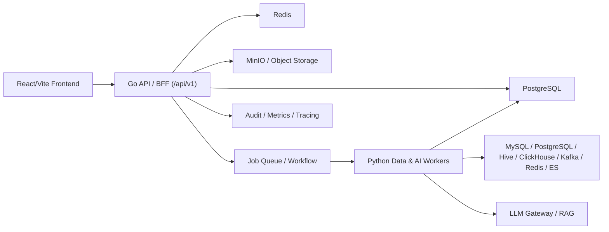

# Plan: DataGov 后端架构与接入路线

**Generated**: 2026-06-08
**Estimated Complexity**: High
**Recommended Direction**: Go 平台控制面 + Python 数据/AI 执行面
**Phase 1 Goal**: 账号密码登录、数据源管理、脚本开发、AI 助手四个闭环优先接入真实后端

## Overview

当前 DataGov 前端已经形成了完整商业数据治理平台骨架，所有页面通过 `src/services/api.ts` 访问相对路径 `/api/v1/*`，再由 MSW Mock 返回数据。后端接入的核心策略是：**保持现有前端 API 契约尽量稳定，先用 Go 建一个模块化单体控制面，再逐步引入 Python Worker 承载数据采集、SQL 分析、血缘、质量核查和 AI 能力。**

目标不是一开始做重型微服务，而是先把“能跑、可审计、可扩展”的后端主干建立起来：



## Architecture Principles

- **前端契约优先**：第一阶段优先兼容当前 `/api/v1` 路径和 `{ code, data, message }` 响应结构，减少前端返工。
- **模块化单体优先**：Go 后端先按领域模块组织，而不是过早拆微服务。
- **控制面与执行面分离**：Go 管平台状态、权限、审计、任务编排；Python 管连接器、SQL/血缘/质量/AI 执行。
- **数据代理外置**：除平台后台库外，其他源数据连接长期应通过独立 Connector Gateway / CDM 类代理项目承载；当前 DataGov 只保留注册、编排、审计和接口预留。
- **异步任务标准化**：采集、核查、血缘、脚本运行、AI 长任务全部进入任务中心，统一状态、日志、重试、审计。
- **Mock 可并存**：真实后端覆盖一个模块后，再逐步关闭对应 MSW handler；未覆盖模块继续 Mock。
- **审计内建**：所有敏感操作、连接器访问、脚本执行、AI 问答都记录审计事件。

## Confirmed Development Environment

前置准备已经完成，首期编码应直接复用以下开发环境，不再以本地 Docker Compose 作为默认前提：

| Capability | Decision |
|---|---|
| PostgreSQL 主库 | 远程 PostgreSQL，业务库 `datagov`，应用账号使用专用低权限用户 |
| PostgreSQL 测试数据源 | 远程样例库 `datagov_sample`，只读样例账号用于连接器测试 |
| 样例数据 | `raw.ods_user`、`raw.ods_order`、`dim.dim_product`、`dwd.dwd_order_detail` |
| Redis | 远程 Redis，首期使用 DB `6`，key prefix 固定为 `datagov:dev:` |
| LLM Provider | MiniMax Anthropic-compatible API，模型 `MiniMax-M3` |
| Secret 管理 | 本地真实配置放在 `.env.local`，示例配置放在 `.env.example`，文档只记录占位符 |

首期开发原则：

- 后端本地启动，直接连接远程 PostgreSQL/Redis。
- 数据源管理中的“样例 PostgreSQL 数据源”指向 `datagov_sample`，用于连接测试、元数据采集和脚本 SQL 验证。
- LLM 通过后端 AI Gateway 访问，前端永不保存或传递模型密钥。
- 远程服务复用现有资源，编码阶段只允许使用专用 DB、Redis DB 和 key prefix，避免影响其他项目。

## Phase 1 Scope Lock

第一阶段不是“先做一个能返回健康检查的空壳”，而是完成四个对前端可见的真实闭环：

1. **账号密码登录**：`POST /api/v1/auth/login`、当前用户、登出、基础 RBAC 和登录审计。
2. **数据源管理**：数据源列表、新建、启停/状态变更、连接测试、同步触发，凭证不回传。
3. **脚本开发**：脚本树、文件夹/脚本创建、保存、版本、运行记录占位、发布审批占位。
4. **AI 助手**：能力列表、任意页面上下文问答、SQL 生成/分析、血缘解释、知识讲解，保留审计与脱敏。

未进入首期真实后端的模块继续走 MSW，避免一次性改造范围失控。

> TODO：数据代理 / Connector Gateway 暂不在 DataGov 当前编码范围内实现。该能力由独立项目推进，DataGov 后续通过稳定接口对接，用于连接测试、元数据采集、SQL 预览、采样和执行审计。

## Suggested Technology Stack

### Control Plane: Go

- **HTTP**: Go 标准库路由、Chi、Echo 或 Gin 均可；建议优先选择轻量、可读、易维护方案。
- **DB Access**: PostgreSQL + `pgx` + SQL migration；复杂查询建议显式 SQL，避免早期 ORM 抽象过厚。
- **Auth**: Session/JWT + RBAC，后续接 OIDC/LDAP/企业 SSO。
- **Config**: 环境变量 + YAML；本地开发从 `.env.local` 读取远程服务连接，生产 Helm/K8s 可选。
- **Observability**: 结构化日志、请求 ID、审计日志、Prometheus 指标、OpenTelemetry 预留。

### Execution Plane: Python

- **Worker Runtime**: Python Worker 通过队列消费任务；必要时提供 FastAPI 内部管理接口。
- **Data Connectors**: SQLAlchemy/DB-API、ClickHouse client、Hive/Trino client、Kafka client、Redis/ES client。
- **SQL Analysis**: `sqlglot` 类工具适合 SQL 方言解析、格式化、静态分析、血缘提取。
- **AI Gateway**: 统一封装模型供应商、Prompt 模板、工具调用、RAG、脱敏与审计。

### Infrastructure

- **PostgreSQL**: 首期使用远程 `datagov` 作为主业务库，使用 schema 分域；JSONB 存储半结构化元数据。
- **Sample PostgreSQL**: 首期使用远程 `datagov_sample` 作为测试数据源，验证连接器、脚本运行和元数据采集链路。
- **Redis**: 首期使用远程 Redis DB `6`，key prefix 为 `datagov:dev:`，承载缓存、短期状态、分布式锁、轻量队列起步。
- **MinIO / S3**: 非首期阻塞项，后续用于导入文件、导出报告、脚本运行产物、采集快照。
- **Queue / Workflow**:
  - 阶段 1 可先用 DB job table 或 Redis Stream。
  - 阶段 3 根据复杂度引入 Temporal 或 NATS JetStream。
- **LLM**: 首期接 MiniMax Anthropic-compatible API；base URL 使用供应商提供的 Anthropic 兼容入口，不在 URL 后额外拼接 `/v1`。

## Repository Layout Proposal

建议后端先作为同仓子目录启动，便于前后端契约同步：

```text
backend/
  cmd/datagov-api/
    main.go
  internal/
    platform/
      config/
      db/
      http/
      auth/
      audit/
      jobs/
      observability/
    modules/
      iam/
      assets/
      metadata/
      standards/
      quality/
      security/
      development/
      services/
      approvals/
      system/
      ai/
    connectors/
      registry/
      mysql/
      postgres/
      hive/
      clickhouse/
      kafka/
      redis/
      elasticsearch/
  migrations/
  openapi/
  tests/

workers/
  python/
    datagov_worker/
      main.py
      config.py
      jobs/
      connectors/
      sql_analysis/
      lineage/
      quality/
      ai/
    tests/

deploy/
  docker-compose.yml
  nginx/
  k8s/
```

## Core Domain Boundaries

### Platform / IAM

- 用户、组织、角色、权限、菜单权限、数据权限。
- 登录、会话、Token 刷新、密码策略。
- 操作审计、登录审计、风险事件。

### Data Source & Connector Registry

- 统一管理 MySQL、PostgreSQL、Hive、ClickHouse、Kafka、Redis、Elasticsearch。
- 密码和密钥不直接明文存库，至少加密；生产阶段接 Vault/KMS。
- 连接测试、连通性健康检查、连接器能力描述。

### Assets & Metadata

- 数据资产目录、资产详情、字段、标签、业务域、Owner、热度、认证状态。
- 元数据采集任务、采集记录、字段结构快照。
- 血缘节点、血缘边、影响分析。

### Standards & Quality

- 数据标准、字段映射、标准评估。
- 质量规则、规则模板、核查批次、问题整改。
- 质量运行产物与报告。

### Development

- 数据模型、脚本开发、脚本版本、脚本运行、发布审批。
- 任务编排、任务调度、任务实例、任务日志。
- 实时计算与数据同步作为任务类型逐步落地。

### AI

- AI 能力卡片、会话、消息、Prompt 模板、工具调用记录。
- SQL 生成、SQL 分析、血缘解释、知识讲解、质量规则建议、任务诊断。
- 模型网关与脱敏策略独立封装，不让前端直接接模型密钥。

## Data Model Sketch

第一阶段不需要一次性建全量表，但主干建议如下：

| Domain | Tables |
|---|---|
| IAM | `users`, `orgs`, `roles`, `permissions`, `role_permissions`, `user_roles`, `sessions` |
| Audit | `audit_events`, `login_events`, `access_events` |
| Data Sources | `data_sources`, `data_source_credentials`, `connector_health_checks` |
| Assets | `assets`, `asset_fields`, `asset_tags`, `business_domains`, `asset_favorites` |
| Metadata | `metadata_collect_tasks`, `metadata_collect_runs`, `metadata_snapshots` |
| Lineage | `lineage_nodes`, `lineage_edges`, `lineage_impact_reports` |
| Standards | `standard_definitions`, `standard_mappings`, `standard_eval_runs` |
| Quality | `quality_rules`, `quality_rule_templates`, `quality_check_runs`, `quality_issues` |
| Development | `scripts`, `script_versions`, `script_runs`, `models`, `task_defs`, `task_instances` |
| Approval | `approval_instances`, `approval_steps`, `approval_comments` |
| AI | `ai_capabilities`, `ai_sessions`, `ai_messages`, `ai_tool_calls` |
| Jobs | `jobs`, `job_logs`, `job_artifacts`, `job_locks` |

## Sprint 1: Go Modular Monolith Foundation

**Goal**: 建立一个可运行的 Go 后端，能接住前端 `/api/v1` 请求，完成认证、健康检查、基础审计，并让登录、数据源管理、脚本开发、AI 助手四个首期模块走真实后端。
**Demo/Validation**:
- `GET /api/v1/health` 返回真实后端健康状态。
- 前端可通过反向代理访问真实 `/api/v1`。
- 登录、当前用户、数据源列表、新建数据源、脚本列表、脚本保存、AI 问答均走真实后端。
- 数据源连接测试可连通远程 `datagov_sample`。

### Task 1.1: Backend Scaffold

- **Location**: `backend/cmd/datagov-api`, `backend/internal/platform`
- **Description**: 创建 Go API 项目结构，接入配置、日志、请求 ID、错误响应。
- **Dependencies**: None
- **Acceptance Criteria**:
  - API 服务可本地启动。
  - 所有响应遵循 `{ code, data, message }`。
  - `GET /api/v1/health` 可用。
- **Validation**:
  - `go test ./...`
  - `curl http://127.0.0.1:8080/api/v1/health`

### Task 1.2: PostgreSQL Migration Foundation

- **Location**: `backend/migrations`, `backend/internal/platform/db`
- **Description**: 接入 PostgreSQL，建立 migrations、连接池、事务工具。
- **Dependencies**: Task 1.1
- **Acceptance Criteria**:
  - 可通过 `.env.local` 连接远程 `datagov`。
  - migrations 可重复执行。
  - health check 包含 DB 和 Redis 状态。
- **Validation**:
  - 在开发库执行 migration dry-run/重放验证。
  - API health 显示 DB connected、Redis connected。

### Task 1.3: Auth & IAM Minimum

- **Location**: `backend/internal/modules/iam`
- **Description**: 实现登录、当前用户、登出、用户/角色基础表。
- **Dependencies**: Task 1.2
- **Acceptance Criteria**:
  - 支持账号密码登录。
  - 返回前端可保存的 token/session。
  - 中间件可保护 API。
  - 记录登录审计。
- **Validation**:
  - 登录成功/失败单元测试。
  - 前端登录页切换到真实接口后可进入系统。

### Task 1.4: API Compatibility Layer

- **Location**: `backend/internal/platform/http`, `backend/openapi`
- **Description**: 梳理现有 `src/services/api.ts` 的 API 清单，生成第一版 OpenAPI 契约。
- **Dependencies**: Task 1.1
- **Acceptance Criteria**:
  - 明确每个 endpoint 的 owner、状态：Mock / Real / Planned。
  - 支持分页、过滤、错误码统一规范。
  - 前端无需一次性重写 API 调用。
- **Validation**:
  - 对比 `src/services/api.ts`，无核心入口遗漏。

### Task 1.5: Data Source Real Module

- **Location**: `backend/internal/modules/metadata`, `backend/internal/connectors`
- **Description**: 先实现数据源管理 CRUD、连接测试、数据源类型字典。
- **Dependencies**: Task 1.2, Task 1.3
- **Acceptance Criteria**:
  - `GET/POST /api/v1/metadata/data-sources` 走真实 DB。
  - `POST /api/v1/metadata/data-sources/:id/test` 可测试样例 PostgreSQL 数据源。
  - `POST /api/v1/metadata/data-sources/:id/sync` 可生成同步任务或同步记录。
  - `POST /api/v1/metadata/data-sources/:id/status` 可启停或标记状态。
  - 连接测试任务能返回状态。
  - 密码字段不回传前端。
- **Validation**:
  - 前端数据源管理页可读写真实数据。
  - 数据源密码不出现在响应体。
  - `datagov_sample` 中样例 schema/table 可被发现。

### Task 1.6: Script Development Minimum

- **Location**: `backend/internal/modules/development`
- **Description**: 实现脚本目录、脚本 CRUD、版本记录、运行记录占位。
- **Dependencies**: Task 1.5
- **Acceptance Criteria**:
  - `GET /api/v1/development/scripts` 走真实 DB。
  - 新建脚本保存在当前目录。
  - 保存生成版本或更新时间。
  - `POST /api/v1/development/scripts/:id/publish` 先生成发布申请占位。
  - `GET /api/v1/development/scripts/:id/versions` 返回真实版本记录。
  - 运行接口先生成 run record，不执行危险脚本。
- **Validation**:
  - 前端脚本开发页可打开、创建、保存。
  - SQL 方言、数据源 ID、目录父子关系持久化正确。

### Task 1.7: AI Assistant Gateway Minimum

- **Location**: `backend/internal/modules/ai`
- **Description**: 先由 Go API 直接封装 MiniMax Anthropic-compatible 调用，保留后续迁移到 Python Worker 的边界。
- **Dependencies**: Task 1.3
- **Acceptance Criteria**:
  - `GET /api/v1/ai/capabilities` 返回前端能力卡片。
  - `POST /api/v1/ai/assistant/messages` 支持页面上下文、能力类型、用户问题。
  - 模型 base URL、token、model 全部来自后端配置。
  - 请求前执行基础脱敏，响应记录会话、消息、引用和审计事件。
- **Validation**:
  - 任意页面唤起 AI 助手可得到真实模型回复。
  - SQL 生成、SQL 分析、血缘解释、知识讲解四类提示词有最小可用结果。
  - 当前 Go AI Gateway 已完成同步问答、能力种子、敏感信息基础脱敏、会话/消息记录和前端 passthrough 联调。

## Sprint 2: Python Data & AI Worker

**Goal**: 引入 Python 执行面，把数据连接、SQL 分析、血缘解析、AI 网关从 Go 控制面中剥离。
**Demo/Validation**:
- 前端 AI 助手调用真实 Go API，Go 投递任务或转发到 Python Worker。
- SQL 分析可返回风险点、优化建议、涉及表字段。
- 数据源连接测试由 Python Worker 执行。

### Task 2.1: Worker Runtime

- **Location**: `workers/python/datagov_worker`
- **Description**: 创建 Python Worker 项目，读取队列任务，执行后回写状态。
- **Dependencies**: Sprint 1 job foundation
- **Acceptance Criteria**:
  - Worker 可启动并注册能力。
  - 支持 job claim、heartbeat、success、failed。
  - 任务日志可回写。
- **Validation**:
  - 投递一个 `echo` job，Worker 执行成功。

### Task 2.2: Connector Execution Layer

- **Location**: `workers/python/datagov_worker/connectors`
- **Description**: 实现 MySQL、PostgreSQL、ClickHouse、Hive 的连接测试和元数据读取接口；首期优先打通 PostgreSQL。
- **Dependencies**: Task 2.1
- **Acceptance Criteria**:
  - 连接器返回统一 schema：database/schema/table/column/type/comment。
  - 连接异常标准化。
  - 支持超时控制。
- **Validation**:
  - 使用远程 `datagov_sample` 做 PostgreSQL 集成测试。
  - 其他连接器先用单元测试和可替换配置预留。

### Task 2.3: SQL Analysis Engine

- **Location**: `workers/python/datagov_worker/sql_analysis`
- **Description**: 解析 SQL 方言，输出表引用、字段引用、风险提示、优化建议。
- **Dependencies**: Task 2.1
- **Acceptance Criteria**:
  - 支持 MySQL/PostgreSQL/Hive/ClickHouse 基础解析。
  - 能识别 `select *`、缺少分区过滤、跨库 Join 等风险。
  - 返回结构化结果给 AI 助手和脚本页。
- **Validation**:
  - 方言样例单元测试。
  - 前端 AI 助手“分析 SQL”展示真实分析结果。

### Task 2.4: Lineage Extraction

- **Location**: `workers/python/datagov_worker/lineage`
- **Description**: 从 SQL、任务依赖、元数据采集记录中生成血缘边。
- **Dependencies**: Task 2.2, Task 2.3
- **Acceptance Criteria**:
  - 支持表级血缘。
  - 字段级血缘先覆盖简单投影和别名。
  - 结果写入 `lineage_nodes` / `lineage_edges`。
- **Validation**:
  - 数据血缘页可读取真实血缘样例。

### Task 2.5: AI Gateway

- **Location**: `backend/internal/modules/ai`, `workers/python/datagov_worker/ai`
- **Description**: Go 提供 `/api/v1/ai/*`，Python 逐步接管 Prompt 编排、工具调用、模型访问；Sprint 1 已有的 Go AI Gateway 保持接口兼容。
- **Dependencies**: Task 2.3
- **Acceptance Criteria**:
  - 支持模型配置，不在前端暴露密钥。
  - 支持会话、消息、引用来源、工具调用记录。
  - 支持脱敏策略：密码、Token、连接串、手机号等不进 Prompt。
- **Validation**:
  - AI 助手能写 SQL、分析 SQL、解释血缘。
  - 审计中可查 AI 请求人、页面上下文、工具调用。

## Sprint 3: Async Job Center & Governance Execution

**Goal**: 把元数据采集、质量核查、血缘分析、脚本运行、同步任务统一纳入任务中心，实现可靠重试、日志、产物和监控。
**Demo/Validation**:
- 前端创建采集/质量任务后，后端异步执行并展示状态。
- 失败任务可重试，日志可追踪。

### Task 3.1: Job State Machine

- **Location**: `backend/internal/platform/jobs`
- **Description**: 定义 job 状态机：queued/running/succeeded/failed/canceled/retrying。
- **Dependencies**: Sprint 1, Sprint 2
- **Acceptance Criteria**:
  - 支持幂等任务 ID。
  - 支持重试策略、超时、取消。
  - 支持 job logs 和 artifacts。
- **Validation**:
  - 单元测试覆盖状态迁移。

### Task 3.2: Metadata Collection Job

- **Location**: `backend/internal/modules/metadata`, `workers/python/datagov_worker/jobs/metadata_collect.py`
- **Description**: 数据源元数据采集真实执行，写入资产与字段快照。
- **Dependencies**: Task 3.1, Task 2.2
- **Acceptance Criteria**:
  - 可选择数据源启动采集。
  - 采集结果可进入资产目录。
  - 采集日志可查看。
- **Validation**:
  - 本地数据库新增表后重新采集，前端可见。

### Task 3.3: Quality Check Job

- **Location**: `backend/internal/modules/quality`, `workers/python/datagov_worker/jobs/quality_check.py`
- **Description**: 按质量规则生成 SQL 或执行检查逻辑，输出问题清单。
- **Dependencies**: Task 3.1, Task 2.2
- **Acceptance Criteria**:
  - 支持完整性、唯一性、及时性、阈值波动规则。
  - 结果写入 check runs 和 issues。
  - 支持问题状态流转。
- **Validation**:
  - 前端质量核查页能触发并看到真实结果。

### Task 3.4: Lineage Impact Job

- **Location**: `backend/internal/modules/assets`, `workers/python/datagov_worker/jobs/lineage_impact.py`
- **Description**: 对脚本、表、字段变更生成影响分析报告。
- **Dependencies**: Task 2.4, Task 3.1
- **Acceptance Criteria**:
  - 给定表或脚本 ID，返回上下游影响列表。
  - 支持风险等级。
  - 结果可被 AI 助手引用。
- **Validation**:
  - 数据血缘页和 AI 助手可复用同一结果。

### Task 3.5: Observability & Operations

- **Location**: `backend/internal/platform/observability`, `deploy/`
- **Description**: 指标、日志、链路追踪、任务告警。
- **Dependencies**: Task 3.1
- **Acceptance Criteria**:
  - 每个 job 有耗时、成功率、失败原因。
  - API 有请求耗时和错误率。
  - 审计事件可按用户/对象/动作查询。
- **Validation**:
  - 运维监控页可接入真实服务状态。

## Sprint 4: Service Boundaries & Production Hardening

**Goal**: 在模块边界稳定后，按性能、安全和团队协作需要拆分服务，并完成生产级部署能力。
**Demo/Validation**:
- 能部署到测试环境。
- 关键模块可独立扩容。
- 安全、审计、备份、回滚策略明确。

### Task 4.1: Decide Split Boundaries

- **Location**: `docs/service-boundaries.md`
- **Description**: 基于实际负载决定是否拆分 Identity、Catalog、Job、AI Gateway、Worker。
- **Dependencies**: Sprint 3
- **Acceptance Criteria**:
  - 每个拆分服务有明确数据 ownership。
  - 内部通信协议明确：REST、gRPC/Connect、事件。
  - 不拆无收益模块。
- **Validation**:
  - 架构评审通过。

### Task 4.2: Production Security

- **Location**: `backend/internal/platform/auth`, `backend/internal/platform/secrets`, `deploy/`
- **Description**: SSO/OIDC、密钥托管、权限策略、数据脱敏、审计保留。
- **Dependencies**: Sprint 1, Sprint 3
- **Acceptance Criteria**:
  - 支持企业 SSO。
  - 数据源凭证加密和轮换。
  - AI Prompt 脱敏和审计可配置。
- **Validation**:
  - 安全测试和权限回归测试。

### Task 4.3: Deployment & Release

- **Location**: `deploy/`, `.github/workflows/` or equivalent CI
- **Description**: Docker 镜像、配置模板、数据库 migration、灰度发布、回滚。
- **Dependencies**: Sprint 3
- **Acceptance Criteria**:
  - 一键启动本地完整栈。
  - 测试环境自动部署。
  - migration 有回滚或前向修复策略。
- **Validation**:
  - 从空环境部署并通过冒烟测试。

### Task 4.4: Contract & Integration Testing

- **Location**: `backend/tests`, `workers/python/tests`, `docs/api-docs`
- **Description**: 建立前后端契约测试、Worker 集成测试、数据源模拟测试。
- **Dependencies**: All previous sprints
- **Acceptance Criteria**:
  - 每个真实 API 有契约样例。
  - Worker 任务有可重复集成测试。
  - 前端关闭 MSW 后核心流程可跑通。
- **Validation**:
  - CI 中执行 API contract test。

## API Migration Strategy

### Step 1: Keep Frontend Stable

保留前端 `src/services/api.ts` 的相对路径 `/api/v1`，后端部署时通过同域代理：

```text
Frontend -> /api/v1/* -> Go API
```

### Step 2: Add Mock Switch

后续可引入：

```text
VITE_USE_MSW=true | false
VITE_API_BASE_URL=/api/v1
```

这样真实后端没覆盖的模块仍能本地 Mock，已覆盖模块关闭对应 handler。

### Step 3: Endpoint Status Matrix

维护一张接口迁移表：

| Status | Meaning |
|---|---|
| Mock | 仍由 MSW 返回 |
| Shadow | 后端已实现，但前端仍走 Mock，可用于对比 |
| Real | 前端正式接真实后端 |
| Deprecated | 前端不再使用 |

## Testing Strategy

- **Go Unit Tests**: handler、service、repository、权限判断。
- **Go Integration Tests**: PostgreSQL migration、真实 DB 查询、事务。
- **Python Unit Tests**: SQL 解析、血缘提取、规则生成、脱敏。
- **Worker Integration Tests**: job 投递、执行、回写、失败重试。
- **Contract Tests**: 对照 `src/services/api.ts` 与 OpenAPI，保证响应结构兼容前端。
- **Frontend E2E**: 登录、数据源管理、脚本保存、AI 助手、质量核查。
- **Security Tests**: 越权访问、凭证泄漏、Prompt 注入、审计缺失。

## Rollout Plan

1. **Local Dev**: 前端 + Go API 本地启动，连接远程 PostgreSQL/Redis。
2. **Hybrid Mode**: 部分真实 API + 部分 MSW。
3. **Test Environment**: 关闭核心模块 MSW，使用测试数据源。
4. **Internal Pilot**: 接入少量真实数据源，只开放数据源、脚本、AI 分析。
5. **Production Hardening**: SSO、审计、密钥管理、备份恢复、监控告警。

## Rollback Plan

- 前端保留 MSW 开关，某个真实模块不稳定时可临时回退 Mock。
- 数据库 migration 使用小步前向变更，不做破坏性字段删除。
- Worker 任务可通过 job cancel/disable 停止新任务。
- AI Gateway 可切换为 Mock/规则回复，避免模型不可用影响平台主流程。

## Potential Risks & Gotchas

- **数据源凭证安全**：必须从第一阶段就避免明文回传；生产阶段接 KMS/Vault。
- **脚本执行安全**：Shell/Python 脚本不能早期直接执行；先支持 SQL 校验和受控执行。
- **血缘准确性**：字段级血缘不可能一步到位，先表级，再覆盖常见 SQL 模式。
- **AI 幻觉**：AI 回复必须标注来源和置信度，关键操作不能直接自动执行。
- **过早拆服务**：没有负载和边界证据前不拆，避免部署复杂度吞掉开发速度。
- **前端接口漂移**：必须维护 endpoint status matrix 和契约测试，否则 Mock 与真实后端会分叉。

## Resolved Decisions

| Topic | Decision |
|---|---|
| 首期闭环 | 登录权限、数据源管理、脚本开发、AI 助手全部进入第一阶段真实后端 |
| 登录方式 | 第一阶段只做账号密码登录，不接企业 SSO |
| 开发环境 | 本地启动后端服务，数据库、缓存等依赖直连远程服务器 |
| 主业务库 | PostgreSQL `datagov` |
| 测试数据源 | PostgreSQL `datagov_sample` |
| 缓存 | Redis DB `6`，key prefix `datagov:dev:` |
| LLM | MiniMax Anthropic-compatible API，模型 `MiniMax-M3` |
| 数据代理 | 暂列 TODO，由独立 Connector Gateway / CDM 类代理项目承载，DataGov 后续做接口集成 |

## Remaining Implementation Questions

1. Go HTTP 框架最终选择 Chi、Echo、Gin 还是标准库路由。
2. 第一版会话机制采用短期 JWT、Redis session，还是 JWT + refresh token。
3. 数据源凭证首期加密方案采用应用级 AES-GCM 还是直接引入 KMS/Vault 预留接口。
4. 外部数据代理项目的接口契约、认证方式、任务回调和错误码规范。
5. Python Worker 是否在 Sprint 1 同步搭空壳，还是 Sprint 2 再引入。
